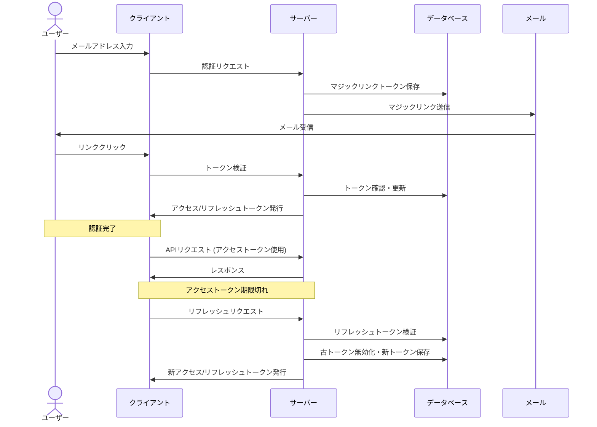

# マジックリンク認証およびトークン管理仕様

## 1. 認証フロー概要

## 2. 詳細フロー

### 2.1 マジックリンク認証
1. ユーザーがメールアドレスを送信
2. サーバーが一意のトークン生成（30分有効）
3. トークンとメールアドレスをDBに保存
4. 認証URLをメールで送信
5. ユーザーがリンクをクリック
6. サーバーがトークン検証（有効期限・未使用確認）
7. 検証成功時、トークンを使用済みに更新

### 2.2 トークン発行
1. 認証成功後、以下を発行:
   - アクセストークン: JWT形式、15分有効
   - リフレッシュトークン: 安全な乱数、14日有効
2. リフレッシュトークンをDBに保存
3. アクセストークンをJSONレスポンスで返却
4. リフレッシュトークンをHTTPOnly Cookieで設定

### 2.3 APIアクセス
1. クライアントは`Authorization: Bearer <token>`ヘッダーでリクエスト
2. サーバーはJWT検証（署名・期限）

### 2.4 トークンリフレッシュ
1. アクセストークン期限切れ時、リフレッシュエンドポイント呼び出し
2. サーバーはCookieからリフレッシュトークン取得・検証
3. 古いリフレッシュトークンを無効化
4. 新しいアクセス/リフレッシュトークンを発行
5. クライアントに新トークンを返却

### 2.5 ログアウト
1. リフレッシュトークンを無効化
2. クライアントはアクセストークン破棄
3. サーバーはCookieを削除

## 3. 拡張機能仕様

### 3.1 デュアル認証方法

#### 3.1.1 マジックリンクと認証コードの併用
- ユーザーには2種類の認証方法を提供:
  1. メールに記載されたマジックリンクのクリック（主要認証手段）
  2. 手動入力可能な短い認証コード（代替認証手段）
- 両方のトークンは同時に生成され、同じメールに記載
- メール内リンクがクリックできない環境でも、短い認証コードで認証可能
- 認証コードは桁数を制限し（6〜8桁）、記憶しやすい形式で提供

#### 3.1.2 認証状態管理

- メールアドレスの認証トークンに関して`verified_count`を使用して不正な認証試行を監視し、一定回数の失敗で自動的に状態を`revoked`に変更
- `last_verified_at`で最終認証時刻を記録し、短時間での連続試行を検出

### 3.2 セキュリティ強化機能

#### 3.2.1 デバイスフィンガープリントによる保護
- 認証要求とトークン利用時のデバイス情報を照合
- 異なるデバイスからのアクセスを検知し、潜在的なリスクを識別
- 既知のデバイスリスト（`user_devices`テーブル）を維持し、新規デバイスログインを識別
- デバイス情報はハッシュ化して保存し、プライバシーを保護
- 検知時に対応:
  1. 高リスク: 再認証を要求
  2. 中リスク: ユーザーに警告メール送信
  3. 低リスク: ログに記録し監視

#### 3.2.2 リフレッシュトークンローテーション
- リフレッシュトークン使用時に新しいトークンを発行（ローテーション）
- 旧トークンは即時無効化
- `rotation_count`によりローテーション回数を追跡
- トークン漏洩に対する防御策:
  - 盗まれたトークンは次回正規ユーザーが使用した時点で無効化
  - 攻撃者が先に使用した場合、正規ユーザーのログインが失敗し異常検知
- 高頻度のローテーション（例: 100回以上）で再認証を要求し、長期的なセッション乗っ取りを防止に備える（未実装）

#### 3.2.3 期限切れトークン自動管理
- 期限切れトークンを検出するためのインデックスを各トークンテーブルに設定
- インデックス（`expired_at`フィールド）を利用した効率的なクエリでトークンを管理
- 実装すべき機能:
  1. 定期的なクリーンアップジョブによる自動削除（日次または時間単位）
  2. 認証済みトークン（`verified`）は履歴保持期間後に削除
  3. 未認証トークン（`pending`）は期限切れ直後に削除

### 3.3 多言語対応

- ユーザーの言語設定に基づく多言語対応（日本語・英語）
- `users.language`フィールドで言語設定を管理（'ja'/'en'）
- 言語設定によって以下をカスタマイズ:
  1. 認証メールの内容と形式
  2. UIテキストとエラーメッセージ
  3. 通知メッセージ
- 言語設定は初期設定後、ユーザープロフィール画面から変更可能

### 3.4 プロフィールと機密情報の分離

- ユーザー情報をセキュリティレベルに応じて分離:
  - 公開情報: 名前、アイコン、自己紹介（`users`テーブル）
  - 機密情報: メールアドレス（`private.sensitive_users`テーブル）
- この分離により:
  1. 一般的なデータ漏洩時に機密情報が保護される
  2. データアクセス権限を細かく制御可能
  3. 個人情報関連法規制へのコンプライアンス対応が容易
- メールアドレス変更時:
  1. 新アドレス宛に確認メール送信
  2. 確認後に変更適用
  3. 古いアドレスにも変更通知送信（セキュリティ対策）

### 3.5 バックエンド実装の考慮事項

#### 3.5.1 UUIDの利用
- すべてのIDフィールドにUUIDv7を使用
- 連番IDと比較したメリット:
  1. グローバルに一意
  2. 推測されにくい（データ漏洩のリスク軽減）
  3. 分散システムでの競合回避

#### 3.5.2 タイムスタンプ自動管理
- すべてのテーブルに作成日時（`created_at`）と更新日時（`updated_at`）を設定
- 更新日時は自動更新（SQL関数により実装）
- これにより:
  1. データ監査証跡の維持
  2. データ鮮度の確認
  3. 異常パターンの検出（短時間での多数の更新など）

## 4. エラーハンドリング
- 無効/期限切れマジックリンク: エラーページ表示、再リクエスト促進
- 無効/期限切れリフレッシュトークン: 401応答、ログイン画面へリダイレクト
- 複数回認証失敗: 一時的なアカウントロック、管理者通知
- 不明デバイスからのアクセス: 追加確認ステップ要求、ユーザーへの通知
- リフレッシュトークン異常使用: 全デバイスでのセッション無効化、再認証要求
