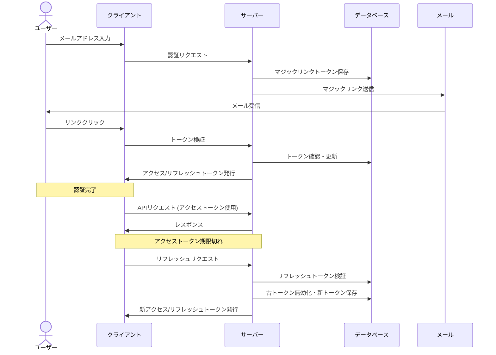

# マジックリンク認証およびトークン管理仕様

## 1. 認証フロー概要

## 2. 詳細フロー

### 2.1 マジックリンク認証
1. ユーザーがメールアドレスを送信
2. サーバーが一意のトークン生成（30分有効）
3. トークンとメールアドレスをDBに保存
4. 認証URLをメールで送信
5. ユーザーがリンクをクリック
6. サーバーがトークン検証（有効期限・未使用確認）
7. 検証成功時、トークンを使用済みに更新

### 2.2 トークン発行
1. 認証成功後、以下を発行:
   - アクセストークン: JWT形式、15分有効
   - リフレッシュトークン: 安全な乱数、14日有効
2. リフレッシュトークンをDBに保存
3. アクセストークンをJSONレスポンスで返却
4. リフレッシュトークンをHTTPOnly Cookieで設定

### 2.3 APIアクセス
1. クライアントは`Authorization: Bearer <token>`ヘッダーでリクエスト
2. サーバーはJWT検証（署名・期限）

### 2.4 トークンリフレッシュ
1. アクセストークン期限切れ時、リフレッシュエンドポイント呼び出し
2. サーバーはCookieからリフレッシュトークン取得・検証
3. 古いリフレッシュトークンを無効化
4. 新しいアクセス/リフレッシュトークンを発行
5. クライアントに新トークンを返却

### 2.5 ログアウト
1. リフレッシュトークンを無効化
2. クライアントはアクセストークン破棄
3. サーバーはCookieを削除

## 3. エラーハンドリング
- 無効/期限切れマジックリンク: エラーページ表示、再リクエスト促進
- 無効/期限切れリフレッシュトークン: 401応答、ログイン画面へリダイレクト
